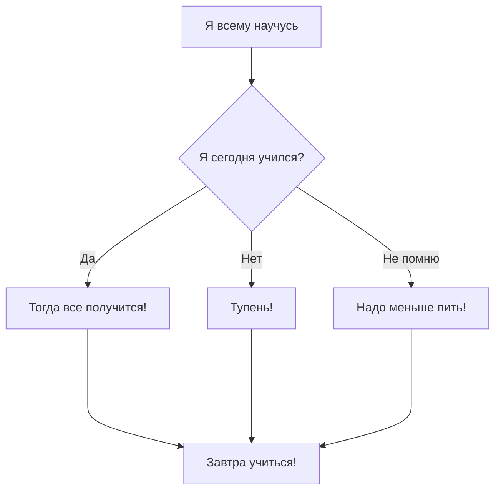

Первое, что изучили

```
ls #показать файлы и папки в директории
ls -la #также показать скрытые файлы и папки
cd #сменить директорию
rm #удалить файл или папку
cat #<>читать или писать в файл
vi #вызов редактора

```

HEAD всему голова



Получится?
